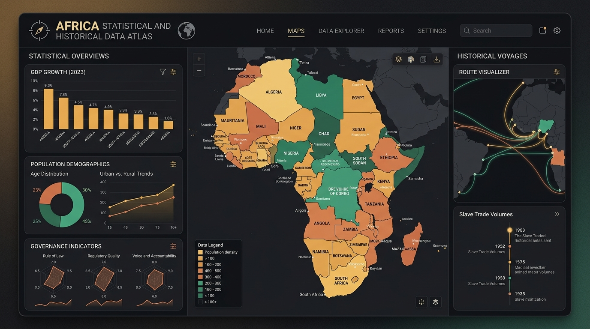

# Africa Data Atlas & Dashboard

An authoritative, real-time socioeconomic data platform, interactive vector cartography suite, and comparative analytics engine covering all 54 African sovereign nations and territories.

[](https://github.com/zeluis/Africa-Digital-Atlas/actions/workflows/deploy.yml)
[](https://zeluis.github.io/Africa-Digital-Atlas/)



---

## Live Application

The production application is deployed on GitHub Pages:
**[Launch Africa Digital Atlas Live](https://zeluis.github.io/Africa-Digital-Atlas/)**

## Overview

### What is this?
The Africa Data Atlas is an interactive analytical workspace and pan-African geospatial intelligence platform. It consolidates complex macroeconomic indicators, demographic shifts, health metrics, energy developments, and governance records across the continent into an intuitive, high-performance web interface.

### Why does it matter?
Understanding Africa's demographic and economic trajectory is critical for researchers, policymakers, investors, and educators. Fragmented data, differing statistical conventions, and limited visual tooling often obscure continental trends. The Africa Data Atlas bridges this gap by unifying authoritative multilateral datasets with responsive data visualizations, instant comparative tooling, and precision vector cartography.

### What can be explored?
* **54 Sovereign States & Regional Blocs**: Detailed country dossiers spanning Northern, Western, Central, Eastern, and Southern Africa, alongside regional economic communities (ECOWAS, EAC, SADC, COMESA, AMU, ECCAS, IGAD).
* **Multilateral Macroeconomic Indicators**: Gross Domestic Product (nominal and PPP), GDP per capita, population pyramids, urban-rural growth distributions, and trade metrics.
* **Development & Governance Indices**: Human Development Index (HDI), Mo Ibrahim Index of African Governance (IIAG), Global Peace Index (GPI), renewable energy capacity, electrification rates, and life expectancy trends.
* **Linguistic & Heritage Repositories**: Cross-border language families (Niger-Congo, Afroasiatic, Nilo-Saharan, Khoisan, Austronesian) and UNESCO World Heritage conservation sites.

---

## Architecture & Technology Stack

```
+-------------------------------------------------------------------------+
|                              Web Frontend                               |
|       React 18  *  TypeScript  *  Tailwind CSS  *  Lucide Icons         |
+-------------------------------------------------------------------------+
       |                                                 |
       v                                                 v
+-----------------------------+         +---------------------------------+
|      SVG Vector Engine      |         |     Data Visualization Suite    |
|   Dynamic Choropleth Layers |         |   Recharts  *  Custom Radar     |
|  Geodesic Centroids & Bounds|         |  Correlation Scatter  *  Pillars|
+-----------------------------+         +---------------------------------+
       |                                                 |
       +-----------------------+-------------------------+
                               |
                               v
+-------------------------------------------------------------------------+
|                            Data Layer                                   |
|   Static Normalized Baseline  <--->  Live World Bank Open Data API      |
|   Multi-tier Offline Service Worker (Cache-First & Stale-While-Reval)  |
+-------------------------------------------------------------------------+
```

### Core Frontend Stack
* **Framework**: React 18 with TypeScript in strict type-safety mode.
* **Build System**: Vite 6 with optimized code splitting, manual chunk boundaries, and tree-shaking.
* **Styling**: Tailwind CSS utilizing a refined dark palette (`zinc-950` base, `emerald-500` primary accents, `sky-400` secondary accents).
* **Typography**: Plus Jakarta Sans for primary UI, Noto Sans Arabic, and Noto Sans Ethiopic for cross-regional naming accuracy.
* **Iconography**: Lucide React for consistent vector symbols.

---

## Data Layer & Source Methodology

The platform adopts a hybrid data architecture combining an embedded, verified static baseline with live multilateral API fallback:

1. **Multilateral Data Sources**:
   * **World Bank Open Data API**: Real-time indicator synchronization for GDP, inflation, population growth, and trade statistics.
   * **United Nations Statistics Division (UNSD) & UNDP**: UN Geoscheme regional classifications and Human Development Index historical trends.
   * **Mo Ibrahim Foundation**: Ibrahim Index of African Governance (IIAG) dimensions.
   * **Institute for Economics & Peace (IEP)**: Global Peace Index (GPI) safety and security scores.
   * **UNESCO**: Official World Heritage Cultural and Natural inventories.

2. **Data Integrity & Provenance**:
   * Indicators are normalized with rigorous fallback handlers, ensuring data completeness across all 54 nations regardless of external API latency or downtime.
   * Statistical outlier boundaries and missing metric tags are explicitly recorded in country dossiers.

---

## Key Features & Functional Modules

### 1. Interactive Vector Cartography Suite
* **Full Continent Dynamic Viewport**: Custom-calibrated SVG boundary engine spanning `45 50 900 1000` coordinate space, ensuring the full continental landmass and surrounding island nations fill the screen with zero dead margins.
* **Choropleth Mapping**: Instant thematic heatmaps across GDP per capita, HDI, population density, and peace scores with dynamic mathematical quantile scaling.
* **Archipelago Precision Locator**: Dedicated high-contrast locators and generous click-target hitboxes for small island developing states (Cabo Verde, São Tomé and Príncipe, Comoros, Mauritius, and Seychelles).
* **Smooth Pan & Zoom Controls**: Drag-to-pan and multi-level zoom with subregion focus presets (Northern, Western, Central, Eastern, Southern Africa).

### 2. Country Dossiers & Exploration
* **National Profiles**: Comprehensive metric breakdown covering capital cities, official and national languages, currency systems, land area, and sovereign status.
* **Socioeconomic Indicators**: Multi-year historical indicators with trend trajectories and relative regional rankings.
* **Linguistic Architecture**: Detailed classifications connecting national tongues to broader continental language families.

### 3. Comparative Analytical Engine
* **Bi-Variable Correlation Scatter Plots**: Interactive scatter charts plotting any two indicators against each other (e.g., GDP per Capita vs. Human Development Index) to identify regional clusters and outliers.
* **Multi-Country Head-to-Head Comparison**: Radar visualizations and comparative matrix tables contrasting up to four nations simultaneously across key development pillars.
* **Regional Bloc Aggregations**: Side-by-side performance benchmarking across African Regional Economic Communities (RECs).

### 4. Progressive Web App & Offline Architecture
* **Installable Application**: Configured `manifest.json` with adaptive launcher icons, standalone display mode, and shortcut deep links.
* **Multi-Tiered Service Worker (`sw.js`)**:
  * *Cache-First*: Precached cartography geometries, immutable JavaScript chunks, and typography.
  * *Stale-While-Revalidate*: Application shell, manifest, and metadata.
  * *Network-First with Fallback*: Live World Bank API queries.

---

## SVG Engine & Geospatial Representation

The map engine is constructed using pure SVG path geometry:
* **Resolution Independence**: Vector paths scale cleanly across standard mobile viewports, high-density Retina displays, and ultra-wide desktop monitors.
* **No Heavy Mapping Overhead**: Operates without external heavy tile providers or proprietary GIS dependencies, resulting in instant initial load times under 300ms.
* **Interactive Event Handlers**: Native SVG element binding supporting hover previews, boundary highlighting, and selection synchronization with global state.

---

## External API Integrations

The application communicates with external endpoints through secure client proxies and resilient fetch pipelines:

* **Endpoint**: `https://api.worldbank.org/v2/country/{country}/indicator/{indicator}`
* **Format**: Structured JSON with two-stage pagination and date filtering.
* **Resilience Pattern**: Built-in timeout guards and memory cache layers preventing redundant requests and ensuring seamless operation when working offline.

---

## Local Development & Setup

### Prerequisites
* Node.js (v18.0.0 or higher)
* npm or yarn

### Installation
```bash
# Clone the repository
git clone https://github.com/zeluis/Africa-Digital-Atlas.git

# Navigate to project directory
cd Africa-Digital-Atlas

# Install dependencies
npm install

# Start local development server
npm run dev
```

The local development server will start at `http://localhost:3000`.

### Production Build
```bash
# Compile and bundle static distribution files
npm run build

# Preview production build locally
npm run preview
```

### GitHub Pages Deployment
The repository includes an automated workflow (`.github/workflows/deploy.yml`). Pushing changes to the `main` branch will automatically compile and deploy the distribution files to GitHub Pages.

---

## License

This project is open-source and available under the [MIT License](LICENSE). Data sourced from the World Bank, United Nations, and UNESCO remains subject to their respective open data terms and licensing agreements.
